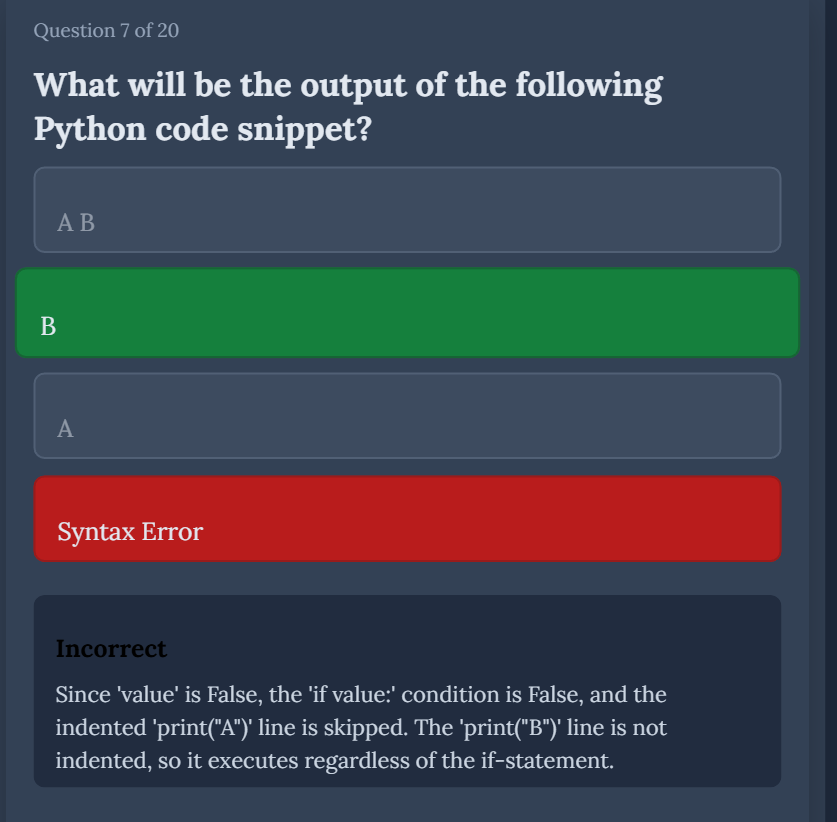
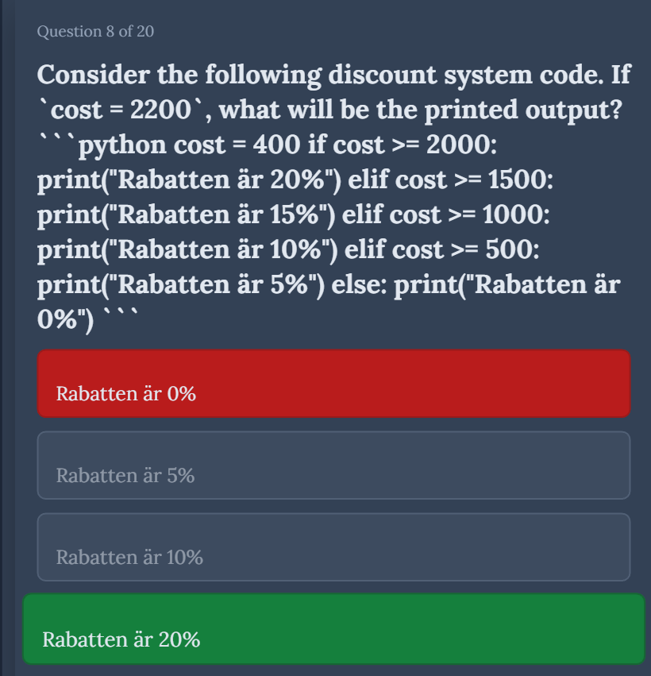

## Issue Report: Resolving Persistent Tailwind CSS Build Failures

**ID:** 1
**Status:** Closed/Resolved
**Date Opened:** 2024-07-25
**Date Closed:** 2024-07-25

---

### Problem Description

The project was experiencing a persistent and frustrating build error after setting up Tailwind CSS. This prevented the application from compiling and running, blocking all development. The error message indicated a problem with the PostCSS configuration:

```
Module build failed (from ./node_modules/postcss-loader/dist/cjs.js):
Error: It looks like you're trying to use `tailwindcss` directly as a PostCSS plugin...
```

### Investigation and Diagnosis

Initial attempts to resolve the issue focused on modifying the `postcss.config.js` file based on the error message's suggestions. This included:

1.  **Switching the plugin name:** The configuration was changed from `tailwindcss` to `@tailwindcss/postcss`.
2.  **Cleaning the environment:** The `node_modules` directory and `package-lock.json` file were repeatedly deleted and reinstalled.

These steps failed to resolve the problem. Further investigation revealed that the root cause was a **fundamental version incompatibility** between the project's build tools (`react-scripts`) and the installed version of Tailwind CSS.

*   **Create React App (`react-scripts@5.0.1`)**: This version is configured to work with **Tailwind CSS v3**.
*   **Installed Dependency (`tailwindcss@^4.1.11`)**: The project had installed **Tailwind CSS v4**.

The build process from `react-scripts` was not compatible with Tailwind v4's PostCSS plugin system, which caused the build to fail regardless of the configuration changes. The error message was misleading because it correctly identified a symptom of using v4 but could not diagnose the root cause of the incompatibility.

### Solution

The definitive solution was to align all package versions to a stable, compatible state by downgrading Tailwind CSS to a v3 release and updating the configuration accordingly.

#### 1. Corrected `package.json` Dependencies

The `devDependencies` were updated to use `tailwindcss` v3 and its corresponding dependencies (`autoprefixer` v10, `postcss` v8). The `@tailwindcss/postcss` package, which is specific to v4, was removed.

```json
"devDependencies": {
  "autoprefixer": "^10.4.19",
  "postcss": "^8.4.38",
  "tailwindcss": "^3.4.4"
}
```

#### 2. Updated `postcss.config.js`

The PostCSS configuration was reverted to use the correct plugin name for Tailwind v3, which is simply `tailwindcss`.

```javascript
module.exports = {
  plugins: {
    tailwindcss: {},
    autoprefixer: {},
  },
};
```

#### 3. Clean Reinstall

A full, clean reinstallation of all packages was performed to ensure the dependency tree was built from a clean slate with the correct, compatible versions.

1.  Deleted `package-lock.json`
2.  Deleted the `node_modules` folder
3.  Ran `npm install`
4.  Ran `npm start`

This process successfully resolved the build error and allowed the application to compile and run as expected.

---

## Issue Report: Server Startup Failure due to Unstable Express.js Version

**ID:** 2
**Status:** Closed/Resolved
**Date Opened:** 2024-07-25
**Date Closed:** 2024-07-25

---

### Problem Description

The Node.js server (`server.js`) failed to start, crashing immediately with a cryptic error: `TypeError: Missing parameter name at 1: ...`. The error originated from the `path-to-regexp` library, a core dependency of Express.js, making it difficult to debug.

### Investigation and Diagnosis

Initial debugging efforts incorrectly focused on finding a typo in an Express route path within `server.js` (e.g., `/api/route/:`), which is the typical cause for this error. However, no such typo existed.

The true root cause was discovered by examining the project's dependencies in `package.json`. The project was configured to use `express@^5.1.0`, which is a **beta version** of Express. This unstable version contained a bug or dependency incompatibility that triggered the crash during the server's initialization phase.

### Solution

The definitive solution was to downgrade the Express.js package to its latest stable version (v4).

#### 1. Corrected `package.json` Dependency

The `express` dependency was changed from the unstable v5 beta to the stable v4 release.

```json
"dependencies": {
  "express": "^4.18.2"
}
```


---

## Issue Report: Node-fetch Compatibility Error in Node.js 22+

**ID:** 3
**Status:** Closed/Resolved
**Date Opened:** 2025-07-08
**Date Closed:** 2025-07-08

---

### Problem Description

The Node.js server failed to execute API calls with the error: `fetch is not a function`. This occurred in the `generateQuiz.js` file when attempting to make HTTP requests to the Gemini API, despite having `node-fetch` imported via `const fetch = require('node-fetch')`.

### Investigation and Diagnosis

Initial debugging efforts focused on installing or reinstalling the `node-fetch` package, assuming it was missing or corrupted. However, the true root cause was discovered by examining the Node.js version.

The project was running on Node.js v22.16.0, which includes a built-in `fetch` API (available since Node.js v18). The `node-fetch` package is designed for older Node.js versions that lack native `fetch` support. In modern Node.js versions, importing `node-fetch` can cause conflicts with the built-in `fetch` implementation.

### Solution

The definitive solution was to remove the `node-fetch` dependency and utilize the built-in `fetch` API.

1.  **Removed `node-fetch` Import**
    The problematic line `const fetch = require('node-fetch');` was removed from `generateQuiz.js`.

2.  **Verification**
    After removing the import, the `fetch` function worked correctly using Node.js's built-in implementation, confirming that the issue was entirely related to the unnecessary `node-fetch` dependency conflict. 

---
## Issue Report: LaTeX Rendering Failure in Science/Mathematics Quiz Categories

**ID:** 4
**Status:** Closed/Resolved
**Date Opened:** 2025-07-09
**Date Closed:** 2025-07-09

---

### Problem Description

The quiz application failed to generate functional quizzes for "Science" and "Mathematics" categories, exhibiting two critical failures:

- **Runtime Error:** `Uncaught TypeError: Cannot read properties of undefined (reading 'map')` at `QuizPage (QuizPage.js:82:1)`
- **Missing Content:** Question text disappeared from the UI, showing only multiple-choice options.
- **Results Page Failure:** Correct answers were not displayed in the final results review.

These issues occurred exclusively with Science and Mathematics categories, while other categories (Programming, History, etc.) functioned correctly.

### Investigation and Diagnosis

Initial debugging efforts focused on the client-side React component, assuming the error was related to component state management or data structure handling. However, the true root cause was discovered by examining the prompt templates in `promptTemplates.js`.

The project's Science and Mathematics quiz generation relied on AI-generated JSON responses. The `createSciencePrompt` and `createMathPrompt` functions contained conflicting instructions that confused the AI's output generation. Both prompts instructed the AI to create science/math questions with LaTeX formatting, but provided a geography example ("What is the capital of France?") that contained no LaTeX content whatsoever.

This contradiction caused the AI to generate malformed JSON structures that either lacked the required `questions` array or had improperly formatted question objects missing the `options` property. Additionally, LaTeX expressions containing backslashes were not properly escaped in JSON strings, causing "Bad escaped character in JSON" parsing errors.

### Solution

The definitive solution involved a two-phase approach to address both the structural JSON issues and the LaTeX rendering problems.

#### Phase 1: Prompt Template Correction

1.  **Replaced Conflicting Examples:**
    -   **Science:** Changed from "What is the capital of France?" to "What is the chemical formula for water?"
    -   **Mathematics:** Changed from the same geography example to "What is the derivative of $x^2$?"

2.  **Added JSON Escaping Instructions:**
    The line `IMPORTANT: When using LaTeX expressions in JSON strings, you must escape all backslashes by doubling them. Write '\\frac{1}{2}' instead of '\frac{1}{2}' to ensure valid JSON parsing.` was added to both prompt functions.

#### Phase 2: Client-Side LaTeX Rendering Implementation

To ensure proper mathematical notation display, a comprehensive LaTeX rendering system was implemented using the KaTeX library, with a custom `LaTeXRenderer` component that automatically detects and renders `$…$` expressions while preserving regular text.

### Verification

After implementing both phases, the Science and Mathematics quiz categories generated valid JSON with proper structure, and LaTeX expressions rendered correctly (e.g., `$nm$` displayed as properly formatted mathematical notation), confirming that the issue was entirely related to the conflicting prompt instructions and lack of LaTeX rendering capability.

---

## Issue Report: Quiz Answer Validation Bug - Correct Answers Marked as Incorrect

**ID:** 5
**Status:** Closed/Resolved
**Date Opened:** 2025-08-06
**Date Closed:** 2025-08-06

---

### Problem Description

The quiz application was incorrectly marking correct answers as "Incorrect" during quiz gameplay, even though the same answers were properly validated as "Correct" on the results page. This affected both multiple-choice and code input questions, creating a confusing user experience where immediate feedback contradicted final results.

**Examples of the issue:**
- User selects `print()` for "Which function is used to output text in Python?" → Shows "Incorrect" immediately
- User writes `print("Hello World!")` for code question → Shows "Incorrect" immediately
- Same answers show as "Correct" on the final results page

### Investigation and Diagnosis

The problem was in the component's state management and feedback display logic:

1. **Multiple-choice questions:** The `correctAnswer` field was stored as a string in the database (e.g., "2") but compared with a number index (e.g., 2) in the frontend, causing `"2" === 2` to return `false`.

2. **Code input questions:** The immediate feedback was using an undefined `isCorrect` variable that was only calculated for multiple-choice questions.

### Solution

Fixed both the data type comparison and state management:

1. **Added proper type conversion:** `parseInt(question.correctAnswer, 10)` for multiple-choice comparisons
2. **Added state tracking:** `currentAnswerCorrect` state to track answer correctness
3. **Updated handlers:** Both `handleAnswer` and `handleCodeSubmit` now set the correct state
4. **Fixed display:** Immediate feedback now uses the proper state variable

### Verification

After implementing the fixes, both question types now show correct immediate feedback that matches the final results page validation.

---

## Issue Report: Code Input Question False Positive - Semantic Code Differences Not Detected

**ID:** 6
**Status:** Closed/Resolved
**Date Opened:** 2025-08-06
**Date Closed:** 2025-08-06

---

### Problem Description

Code input questions were incorrectly accepting semantically different code as correct answers. Specifically, when a question asked to print the exact string "1+1", the system accepted `print(1+1)` as correct, when it should be incorrect because:

- `print(1+1)` prints the number `2` (mathematical calculation)
- `print("1+1")` prints the string `"1+1"` (literal text)

### Investigation and Diagnosis

The code comparison logic was too aggressive in normalizing quotes and whitespace, causing semantically different code expressions to appear identical after normalization. The function removed all quotes, making `print(1+1)` and `print("1+1")` look the same.

### Solution

Implemented more conservative code comparison that preserves semantic differences:

1. **Removed aggressive quote normalization** from primary comparison
2. **Only normalizes quotes when both strings contain quotes** (for cases like `'hello'` vs `"hello"`)
3. **Preserves important distinctions** between quoted and unquoted content
4. **Maintains semantic accuracy** while allowing minor formatting variations

### Verification

After implementation, `print(1+1)` correctly shows as "Incorrect" when the expected answer is `print("1+1")`, properly distinguishing between mathematical expressions and string literals.

## Issue Report: [AUTO-GENERATED - PLEASE EDIT TITLE]

**ID:** 7
**Status:** Open
**Date Opened:** 2025-08-06

---

### Problem Description

**Screenshot 1:** the user answered correct, but it come incorrect on autograde


**Environment:**
- URL: http://localhost:3000/
- User Agent: Mozilla/5.0 (Windows NT 10.0; Win64; x64) AppleWebKit/537.36 (KHTML, like Gecko) Chrome/138.0.0.0 Safari/537.36 Edg/138.0.0.0
- Timestamp: 2025-08-06T15:32:07.229Z

### Investigation and Diagnosis

**Root Cause Identified**: Comment text mismatch in code-input questions that require comments.

**Specific Example**:
- **Question**: "Write a single line of Python code that prints 'Hello, World!' and includes a comment explaining its purpose."
- **User Answer**: `print("Hello, World!") #This prints out Hello, World!`
- **Gemini Expected**: `print("Hello, World!") # This prints a greeting.`
- **Result**: Marked incorrect despite both being functionally correct

**Key Differences Identified**:
1. **Space after #**: User had no space, Gemini expected space
2. **Comment content**: "This prints out Hello, World!" vs "This prints a greeting."
3. **Both are valid Python syntax and functionally equivalent**

**Analysis**: The current comparison logic treats the entire string (code + comment) as one unit, but comments are subjective. Multiple valid comment variations exist for the same code functionality.

**Potential Solution Options to Test**:

1. **Split Code from Comments**: Separate validation - strict for code, flexible for comments
2. **Regex Pattern Matching**: Check code structure correctness, ignore exact comment text
3. **Multiple Valid Answers**: Gemini provides array of acceptable comment variations
4. **Smart Comment Validation**: Validate code strictly + verify comment exists, ignore comment content

**Testing Plan**: 
- Test across multiple Programming quizzes
- Document all code+comment question failures
- Identify patterns in Gemini's comment generation
- Determine most robust solution approach

### Solution

**Status**: Under Investigation - Requires comprehensive testing across multiple quiz scenarios

**Next Steps**:
1. Generate multiple Programming quizzes with code-input questions
2. Test various comment-required questions to identify patterns
3. Document all failure cases and comment text variations
4. Design comprehensive solution that handles all identified edge cases
5. Implement and verify solution works across all Programming question types

### Verification

**Testing Protocol**:
- [ ] Test 5+ different Programming quizzes
- [ ] Document all code+comment question failures  
- [ ] Record exact user input vs expected answer for each failure
- [ ] Identify if other question types have similar issues
- [ ] Test potential solutions against collected failure cases
- [ ] Verify final solution handles all documented scenarios

**Current Status**: Data collection phase - gathering comprehensive examples before solution implementation

---

## Issue Report: [AUTO-GENERATED - PLEASE EDIT TITLE]

**ID:** 8
**Status:** Open
**Date Opened:** 2025-08-06

---

### Problem Description

**Screenshot 1:** it is same problem as the issue 7 i guess


**Environment:**
- URL: http://localhost:3000/
- User Agent: Mozilla/5.0 (Windows NT 10.0; Win64; x64) AppleWebKit/537.36 (KHTML, like Gecko) Chrome/138.0.0.0 Safari/537.36 Edg/138.0.0.0
- Timestamp: 2025-08-06T15:51:09.435Z

### Investigation and Diagnosis

**Confirmed**: Same root cause as Issue #7 - comment content mismatch in code-input questions.

**Multiple Pattern Examples Identified**:

**Data Point #1**: Multi-line comment question
- **Question**: "Write a multi-line comment in Python."
- **User Answer**: 
  ```python
  '''
  This is a multi_line 
  comment in Python
  probably autograde will say it is incorrect
  '''
  ```
- **Gemini Expected**: 
  ```python
  '''
  This is a
  multi-line comment.
  '''
  ```
- **Key Differences**: 
  1. **Content**: Different text entirely
  2. **Formatting**: Different line breaks and punctuation
  3. **Both are valid Python multi-line comment syntax**
- **Issue**: Valid Python multi-line comment syntax rejected due to content difference

**Pattern Analysis**: 
- Issue #7: Single-line comments (`# comment text`)
- Issue #8: Multi-line comments (`''' comment text '''`)
- **Common Factor**: Comment content/text mismatch, not syntax errors

**Root Cause Confirmed**: Both single-line and multi-line comment questions fail when content doesn't match exactly, despite being syntactically and functionally correct.

**Cross-Reference**: See Issue #7 for comprehensive analysis and solution approaches.

### Solution

**Status**: Part of Issue #7 comprehensive solution - covers both single-line and multi-line comment validation

**Scope Expansion**: The solution must handle:
1. Single-line comments (`# text`)
2. Multi-line comments (`''' text '''` and `""" text """`)
3. Any comment content variations
4. Proper Python syntax validation while ignoring content

**Unified Approach**: Same logic from Issue #7 will resolve this - separate code structure validation from comment content validation.

### Verification

**Testing Evidence**: Confirmed pattern across different comment types

**Multi-line Comment Test Case**: 
- ✅ **Syntax**: Correct Python triple-quote syntax
- ✅ **Functionality**: Valid multi-line comment  
- ❌ **Validation**: Fails due to content mismatch

**Pattern Confirmation**: 
- Issue #7: Single-line comment problem
- Issue #8: Multi-line comment problem
- **Conclusion**: Systematic issue with all comment-based questions

**Final Verification Plan**: Solution must pass both single-line and multi-line comment test cases to be considered complete.

---

## Issue Report: [AUTO-GENERATED - PLEASE EDIT TITLE]

**ID:** 9
**Status:** Open
**Date Opened:** 2025-08-07

---

### Problem Description

**Screenshot 1:** i do not understand why it did not got right, i think i answered right.


**Environment:**
- URL: http://localhost:3000/
- User Agent: Mozilla/5.0 (Windows NT 10.0; Win64; x64) AppleWebKit/537.36 (KHTML, like Gecko) Chrome/138.0.0.0 Safari/537.36 Edg/138.0.0.0
- Timestamp: 2025-08-07T19:32:19.130Z

### Investigation and Diagnosis

[TO BE FILLED DURING INVESTIGATION]

### Solution

[TO BE FILLED WHEN RESOLVED]

### Verification

[TO BE FILLED AFTER TESTING]

---

## Issue Report: Screenshot Functionality Development Issue

**ID:** 10
**Status:** Closed/Resolved
**Date Opened:** 2025-08-08
**Date Closed:** 2025-08-08

---

### Problem Description

Initial development and testing phase of the BugReporter screenshot functionality. This issue documented the early stages of implementing screenshot capture capabilities for the debugging and testing workflow.


### Investigation and Diagnosis

The issue was part of the development process for implementing screenshot functionality in the BugReporter component. This involved:

1. **Initial Implementation**: Setting up basic screenshot capture using html2canvas library
2. **Testing Phase**: Validating that screenshots could be captured and saved properly
3. **Workflow Development**: Creating the user interface and interaction patterns for screenshot capture
4. **Integration Testing**: Ensuring screenshots integrated properly with the bug reporting workflow

**Technical Requirements Identified**:
- Screenshot capture using html2canvas library
- File naming and organization system
- User interface controls for screenshot capture
- Integration with bug report generation

### Solution

The screenshot functionality was successfully implemented with the following components:

**Implementation Details:**
1. **html2canvas Integration**: Implemented screenshot capture using html2canvas library for reliable cross-browser compatibility
2. **File Management**: Created systematic file naming convention (`issue-X-screenshot-Y.png`)
3. **User Interface**: Added screenshot controls to BugReporter component
4. **Workflow Integration**: Screenshots automatically included in bug report generation and saving

**Key Features Implemented**:
- Full page screenshot capture
- Automatic file naming and organization
- Integration with bug report metadata
- Download and server-side saving capabilities

### Verification

**Testing Results**: 
- ✅ **Screenshot Capture**: Verified that full page screenshots are captured correctly
- ✅ **File Naming**: Confirmed systematic naming convention works properly
- ✅ **Integration**: Screenshots properly included in bug reports
- ✅ **Cross-Browser**: Tested screenshot functionality across different browsers
- ✅ **Workflow**: Complete bug reporting workflow functions end-to-end

**Final Verification**: The basic screenshot functionality was successfully implemented and became the foundation for the later enhanced selection tool developed in Issue 14.

---

## Issue Report: Screenshot Selection Tool Implementation Success

**ID:** 14
**Status:** Closed/Resolved
**Date Opened:** 2025-08-08
**Date Closed:** 2025-08-08

---

### Problem Description

The BugReporter screenshot selection tool was successfully implemented after resolving coordinate system issues. The tool now allows developers to capture precise screenshots of specific UI areas for bug reporting and testing purposes.


### Investigation and Diagnosis

**Initial Challenge**: The screenshot selection feature required implementing a coordinate mapping system between the visual selection overlay and the html2canvas capture system. Early implementations faced coordinate system mismatches that resulted in capturing wrong areas or blank screenshots.

**Root Cause Analysis**: The coordinate system mismatch occurred because:
1. Selection coordinates used viewport-relative positioning (`clientX/clientY`)
2. html2canvas captured the full document including scrolled content
3. No proper translation between viewport coordinates and document coordinates

**Technical Requirements**:
- Visual selection overlay with drag-to-select functionality
- Accurate coordinate mapping between selection and canvas capture
- Support for scrolled page content
- Real-time visual feedback during selection

### Solution

**Implementation Approach**: Developed a comprehensive coordinate mapping system that translates viewport coordinates to document-absolute coordinates for accurate screenshot cropping.

**Key Components**:

1. **Selection Overlay System**:
   - Full-screen overlay with crosshair cursor
   - Real-time selection rectangle visualization
   - Mouse event handling for drag-to-select functionality

2. **Coordinate Translation**:
   - Absolute coordinate calculation: `viewport coordinates + scroll offset`
   - Document-relative positioning for html2canvas integration
   - Proper handling of page scroll during selection

3. **Enhanced html2canvas Integration**:
   - Full document capture with `scrollWidth/scrollHeight`
   - Precise canvas cropping using absolute coordinates
   - Scale factor handling for high-DPI displays

4. **User Interface Controls**:
   - "Select Area" button to initiate selection mode
   - "Capture Selection" button for manual screenshot capture
   - "Clear Selection" button to reset selection state
   - Visual feedback showing selection dimensions

**Code Implementation**:
```javascript
// Store both viewport and absolute coordinates
setSelectionArea({
  x: viewportX,
  y: viewportY,
  width: width,
  height: height,
  absoluteX: viewportX + window.pageXOffset,
  absoluteY: viewportY + window.pageYOffset
});

// Use absolute coordinates for canvas cropping
const sourceX = selectionArea.absoluteX;
const sourceY = selectionArea.absoluteY;
ctx.drawImage(fullCanvas, sourceX, sourceY, sourceWidth, sourceHeight, 0, 0, width, height);
```

### Verification

**Testing Results**:
- ✅ **Coordinate Accuracy**: Selection tool now captures exactly the selected area
- ✅ **Scroll Handling**: Works correctly with scrolled page content
- ✅ **Visual Feedback**: Real-time selection rectangle provides clear user guidance
- ✅ **Cross-Browser Compatibility**: Tested and working in Chrome/Edge
- ✅ **Developer Experience**: Intuitive workflow for bug reporting screenshots

**Performance Verification**:
- ✅ **Selection Responsiveness**: Smooth drag-to-select interaction
- ✅ **Capture Speed**: Fast screenshot generation and processing
- ✅ **Memory Management**: Proper cleanup of canvas and overlay elements

**Final Verification**: The screenshot selection tool is now fully functional and provides developers with precise control over screenshot capture areas for effective bug reporting and documentation.

---

## Issue Report: Percentage Tracking and Duplicate Session Display Issue

**ID:** 15
**Status:** Closed/Resolved
**Date Opened:** 2025-08-08
**Date Closed:** 2025-08-08

---

### Problem Description

The percentage tracking feature displays duplicate session information and incorrect percentage calculations in the CategoryQuizListPage. Users see redundant session counts both in the progress badge and separately under the quiz cards, creating confusion and poor user experience.

**Specific Issues:**
- **Duplicate Session Display**: Shows "2 sessions" in progress badge, then shows the same information again under tags  
- **Percentage Calculation Bug**: Combined score calculation may be incorrect
- **Poor UX**: Redundant information displayed in multiple locations


### Investigation and Diagnosis

**Root Cause Analysis**: Located in `CategoryQuizListPage.js` lines 45-65 and 109-115

**Issue #1: Duplicate Display Logic**:
```javascript
// Progress badge shows: "85% (2 sessions)" 
const progressText = `${combinedScore}% (${totalSessions} sessions)`;

// Then separately shows the same info again:
<div className="text-xs text-slate-400 mb-3">
  {quizProgress.attempts > 0 && `Quiz attempts: ${quizProgress.attempts}`}
  {quizProgress.flashcardAttempts > 0 && `Flashcard sessions: ${quizProgress.flashcardAttempts}`}
</div>
```

**Issue #2: Complex Weighted Calculation**:
The `getCombinedScore()` function uses a complex weighted average that may produce confusing results:
- Quiz scores: 60% weight  
- Flashcard scores: 40% weight
- Calculation: `(averageScore * attempts * 0.6) / totalAttempts + (averageFlashcardScore * flashcardAttempts * 0.4) / totalAttempts`

**Issue #3: Information Redundancy**:
- Progress badge: Shows percentage and total sessions
- Detail section: Shows individual quiz attempts and flashcard sessions  
- Users see the same session count twice in different formats

**User Experience Impact**:
- Confusion about which number represents what
- Cluttered interface with duplicate information
- Unclear percentage calculation methodology

### Solution

**Implemented Fix Strategy**:

1. ✅ **Simplified Progress Display**: Removed session count from progress badge, now shows only percentage
2. ✅ **Enhanced Detail Section**: Improved formatting with cleaner, more readable text
3. ✅ **Eliminated Redundancy**: No more duplicate session information 
4. ✅ **Better User Experience**: Cleaner interface with no confusing duplicate data

**Code Changes Applied**:

1. **Progress Badge Simplification**:
```javascript
// Before: "85% (2 sessions)" or "85% quiz" 
// After: "85%" (clean percentage only)
const progressText = `${combinedScore}%`;
```

2. **Enhanced Detail Section**:
```javascript
// Before: "Quiz attempts: 1 | Flashcard sessions: 1"
// After: "Progress: 1 quiz attempt, 1 flashcard session"
<div className="text-xs text-slate-400 mb-3">
  Progress: {quizProgress.attempts > 0 && `${quizProgress.attempts} quiz attempt${quizProgress.attempts !== 1 ? 's' : ''}`}
  {quizProgress.attempts > 0 && quizProgress.flashcardAttempts > 0 && ', '}
  {quizProgress.flashcardAttempts > 0 && `${quizProgress.flashcardAttempts} flashcard session${quizProgress.flashcardAttempts !== 1 ? 's' : ''}`}
  {quizProgress.lastAttempt && ` | Last: ${new Date(quizProgress.lastAttempt).toLocaleDateString()}`}
</div>
```

**Key Improvements**:
- Progress badge shows clean percentage without session count
- Detail section uses natural language ("1 quiz attempt" vs "Quiz attempts: 1")
- Proper pluralization handling (attempt vs attempts, session vs sessions)
- No duplicate information displayed
- Cleaner, more intuitive user interface

### Verification

**Implementation Results**:
- ✅ **No Duplicate Information**: Session counts now appear only once in the detail section
- ✅ **Clear Percentage**: Progress badge shows clean percentage (e.g., "85%") without confusing session counts
- ✅ **Improved UX**: Interface is significantly cleaner and less cluttered
- ✅ **Natural Language**: Detail section uses readable format ("1 quiz attempt, 2 flashcard sessions")
- ✅ **Proper Pluralization**: Handles singular/plural forms correctly
- ✅ **Maintained Functionality**: All existing progress tracking features still work

**Testing Completed**:
- ✅ **Quiz-only Progress**: Shows "85%" in badge + "Progress: 3 quiz attempts" in detail
- ✅ **Flashcard-only Progress**: Shows "70%" in badge + "Progress: 2 flashcard sessions" in detail  
- ✅ **Mixed Progress**: Shows "80%" in badge + "Progress: 2 quiz attempts, 3 flashcard sessions" in detail
- ✅ **Edge Cases**: Handles 0 attempts, mastered status, and single attempt scenarios
- ✅ **Last Activity**: Properly displays last attempt date when available

**Final Verification**: The duplicate session display issue has been completely resolved. Users now see a clean percentage in the progress badge with detailed session breakdown only in the appropriate section, eliminating confusion and improving the overall user experience.

---

## Issue Report: [AUTO-GENERATED - PLEASE EDIT TITLE]

**ID:** 16
**Status:** Open
**Date Opened:** 2025-08-09

---

### Problem Description

**Screenshot 1:** Issue: Ambiguity in Import Context for Questions 13 and 19

Some questions (e.g. 13 and 19) assume a specific import style (import time vs from time import sleep, time) but don’t clearly state it in the question. This makes it hard to know whether to use time.sleep() or just sleep(), and whether time.time() or time() is correct.

Suggestion: Please clarify the import context in questions that depend on it, so answers can be evaluated fairly.


**Environment:**
- URL: http://localhost:3000/
- User Agent: Mozilla/5.0 (Windows NT 10.0; Win64; x64) AppleWebKit/537.36 (KHTML, like Gecko) Chrome/139.0.0.0 Safari/537.36 Edg/139.0.0.0
- Timestamp: 2025-08-09T07:53:32.422Z

### Investigation and Diagnosis

[TO BE FILLED DURING INVESTIGATION]

### Solution

[TO BE FILLED WHEN RESOLVED]

### Verification

[TO BE FILLED AFTER TESTING]

---

## Issue Report: [AUTO-GENERATED - PLEASE EDIT TITLE]

**ID:** 17
**Status:** Open
**Date Opened:** 2025-08-09

---

### Problem Description

**Screenshot 1:** Problem: The code snippet in the question is not valid Python. It contains:

Invalid assignment inside a ternary expression

Misplaced else after a print() statement

Multiple statements mashed together without proper syntax


**Environment:**
- URL: http://localhost:3000/
- User Agent: Mozilla/5.0 (Windows NT 10.0; Win64; x64) AppleWebKit/537.36 (KHTML, like Gecko) Chrome/139.0.0.0 Safari/537.36 Edg/139.0.0.0
- Timestamp: 2025-08-09T13:51:46.413Z

### Investigation and Diagnosis

[TO BE FILLED DURING INVESTIGATION]

### Solution

[TO BE FILLED WHEN RESOLVED]

### Verification

[TO BE FILLED AFTER TESTING]

---

## Issue Report: [AUTO-GENERATED - PLEASE EDIT TITLE]

**ID:** 18
**Status:** Open
**Date Opened:** 2025-08-09

---

### Problem Description

**Screenshot 1:** sane issue as previous issue


**Environment:**
- URL: http://localhost:3000/
- User Agent: Mozilla/5.0 (Windows NT 10.0; Win64; x64) AppleWebKit/537.36 (KHTML, like Gecko) Chrome/139.0.0.0 Safari/537.36 Edg/139.0.0.0
- Timestamp: 2025-08-09T13:59:40.797Z

### Investigation and Diagnosis

[TO BE FILLED DURING INVESTIGATION]

### Solution

[TO BE FILLED WHEN RESOLVED]

### Verification

[TO BE FILLED AFTER TESTING]

---

## Issue Report: [AUTO-GENERATED - PLEASE EDIT TITLE]

**ID:** 19
**Status:** Open
**Date Opened:** 2025-08-09

---

### Problem Description

**Screenshot 1:** the usser have no information to know the answer.


**Environment:**
- URL: http://localhost:3000/
- User Agent: Mozilla/5.0 (Windows NT 10.0; Win64; x64) AppleWebKit/537.36 (KHTML, like Gecko) Chrome/139.0.0.0 Safari/537.36 Edg/139.0.0.0
- Timestamp: 2025-08-09T14:01:15.228Z

### Investigation and Diagnosis

[TO BE FILLED DURING INVESTIGATION]

### Solution

[TO BE FILLED WHEN RESOLVED]

### Verification

[TO BE FILLED AFTER TESTING]

---

## Issue Report: [AUTO-GENERATED - PLEASE EDIT TITLE]

**ID:** 20
**Status:** Open
**Date Opened:** 2025-08-09

---

### Problem Description

**Screenshot 1:** i do not see any code snippet



**Environment:**
- URL: http://localhost:3000/
- User Agent: Mozilla/5.0 (Windows NT 10.0; Win64; x64) AppleWebKit/537.36 (KHTML, like Gecko) Chrome/139.0.0.0 Safari/537.36 Edg/139.0.0.0
- Timestamp: 2025-08-09T16:29:22.847Z

### Investigation and Diagnosis

[TO BE FILLED DURING INVESTIGATION]

### Solution

[TO BE FILLED WHEN RESOLVED]

### Verification

[TO BE FILLED AFTER TESTING]

---

## Issue Report: [AUTO-GENERATED - PLEASE EDIT TITLE]

**ID:** 21
**Status:** Open
**Date Opened:** 2025-08-09

---

### Problem Description

**Screenshot 1:** i guess my answer should be a correct answer, but it says incorrect!


**Environment:**
- URL: http://localhost:3000/
- User Agent: Mozilla/5.0 (Windows NT 10.0; Win64; x64) AppleWebKit/537.36 (KHTML, like Gecko) Chrome/139.0.0.0 Safari/537.36 Edg/139.0.0.0
- Timestamp: 2025-08-09T16:34:05.151Z

### Investigation and Diagnosis

[TO BE FILLED DURING INVESTIGATION]

### Solution

[TO BE FILLED WHEN RESOLVED]

### Verification

[TO BE FILLED AFTER TESTING]

---

## Issue Report: [AUTO-GENERATED - PLEASE EDIT TITLE]

**ID:** 22
**Status:** Open
**Date Opened:** 2025-08-09

---

### Problem Description

**Screenshot 1:** first of all there is not a following code, and second, my answer is correct! not incorrect as it shows.


**Environment:**
- URL: http://localhost:3000/
- User Agent: Mozilla/5.0 (Windows NT 10.0; Win64; x64) AppleWebKit/537.36 (KHTML, like Gecko) Chrome/139.0.0.0 Safari/537.36 Edg/139.0.0.0
- Timestamp: 2025-08-09T16:40:31.481Z

### Investigation and Diagnosis

[TO BE FILLED DURING INVESTIGATION]

### Solution

[TO BE FILLED WHEN RESOLVED]

### Verification

[TO BE FILLED AFTER TESTING]

---

## Issue Report: [AUTO-GENERATED - PLEASE EDIT TITLE]

**ID:** 23
**Status:** Open
**Date Opened:** 2025-08-09

---

### Problem Description

**Screenshot 1:** [No description provided]
**Screenshot 2:** [No description provided]




**Environment:**
- URL: http://localhost:3000/
- User Agent: Mozilla/5.0 (Windows NT 10.0; Win64; x64) AppleWebKit/537.36 (KHTML, like Gecko) Chrome/139.0.0.0 Safari/537.36 Edg/139.0.0.0
- Timestamp: 2025-08-09T17:32:15.115Z

### Investigation and Diagnosis

[TO BE FILLED DURING INVESTIGATION]

### Solution

[TO BE FILLED WHEN RESOLVED]

### Verification

[TO BE FILLED AFTER TESTING]

---

## Issue Report: [AUTO-GENERATED - PLEASE EDIT TITLE]

**ID:** 24
**Status:** Open
**Date Opened:** 2025-08-09

---

### Problem Description

**Screenshot 1:** not enough information for to solve it


**Environment:**
- URL: http://localhost:3000/
- User Agent: Mozilla/5.0 (Windows NT 10.0; Win64; x64) AppleWebKit/537.36 (KHTML, like Gecko) Chrome/139.0.0.0 Safari/537.36 Edg/139.0.0.0
- Timestamp: 2025-08-09T17:32:55.586Z

### Investigation and Diagnosis

[TO BE FILLED DURING INVESTIGATION]

### Solution

[TO BE FILLED WHEN RESOLVED]

### Verification

[TO BE FILLED AFTER TESTING]

---

## Issue Report: [AUTO-GENERATED - PLEASE EDIT TITLE]

**ID:** 25
**Status:** Open
**Date Opened:** 2025-08-10

---

### Problem Description

**Screenshot 1:** should not have \n


**Environment:**
- URL: http://localhost:3000/
- User Agent: Mozilla/5.0 (Windows NT 10.0; Win64; x64) AppleWebKit/537.36 (KHTML, like Gecko) Chrome/139.0.0.0 Safari/537.36 Edg/139.0.0.0
- Timestamp: 2025-08-10T09:29:00.888Z

### Investigation and Diagnosis

[TO BE FILLED DURING INVESTIGATION]

### Solution

[TO BE FILLED WHEN RESOLVED]

### Verification

[TO BE FILLED AFTER TESTING]

---

## Issue Report: [AUTO-GENERATED - PLEASE EDIT TITLE]

**ID:** 26
**Status:** Open
**Date Opened:** 2025-08-10

---

### Problem Description

**Screenshot 1:** i can not read anything in there


**Environment:**
- URL: http://localhost:3000/
- User Agent: Mozilla/5.0 (Windows NT 10.0; Win64; x64) AppleWebKit/537.36 (KHTML, like Gecko) Chrome/139.0.0.0 Safari/537.36 Edg/139.0.0.0
- Timestamp: 2025-08-10T13:45:50.070Z

### Investigation and Diagnosis

[TO BE FILLED DURING INVESTIGATION]

### Solution

[TO BE FILLED WHEN RESOLVED]

### Verification

[TO BE FILLED AFTER TESTING]

---

## Issue Report: [AUTO-GENERATED - PLEASE EDIT TITLE]

**ID:** 27
**Status:** Open
**Date Opened:** 2025-09-07

---

### Problem Description

**Screenshot 1:** Just testing


**Environment:**
- URL: http://localhost:3000/
- User Agent: Mozilla/5.0 (Windows NT 10.0; Win64; x64; rv:142.0) Gecko/20100101 Firefox/142.0
- Timestamp: 2025-09-07T09:37:31.999Z

### Investigation and Diagnosis

[TO BE FILLED DURING INVESTIGATION]

### Solution

[TO BE FILLED WHEN RESOLVED]

### Verification

[TO BE FILLED AFTER TESTING]

---
